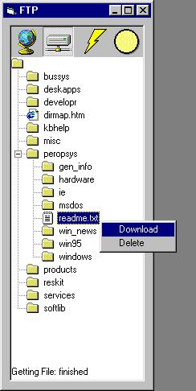



## FTP treeview simple/advanced

### Description

Simple to use due to the Advanced code. i looked around for a FTP program on this site that uses TreeView but couldnt find one so i made my own! (i made it for a bigger program which is y there is a button that does'nt do anything) P.S. if your like the code please vote at the bottom of this page, thanx
 
### More Info
 

             |
---                |---
**Submitted On**   |2001-07-23 16:40:40
**By**             |[syphen](https://github.com/Planet-Source-Code/PSCIndex/blob/master/ByAuthor/syphen.md)
**Level**          |Intermediate
**User Rating**    |4.7 (28 globes from 6 users)
**Compatibility**  |VB 6\.0
**Category**       |[Internet/ HTML](https://github.com/Planet-Source-Code/PSCIndex/blob/master/ByCategory/internet-html__1-34.md)
**World**          |[Visual Basic](https://github.com/Planet-Source-Code/PSCIndex/blob/master/ByWorld/visual-basic.md)
**Archive File**   |[FTP treevi24045832001\.zip](https://github.com/Planet-Source-Code/syphen-ftp-treeview-simple-advanced__1-25837/archive/master.zip)

